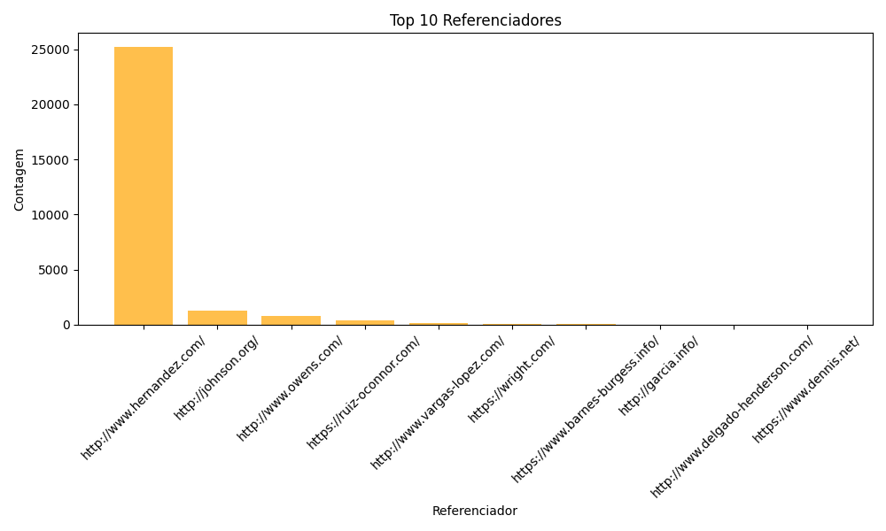
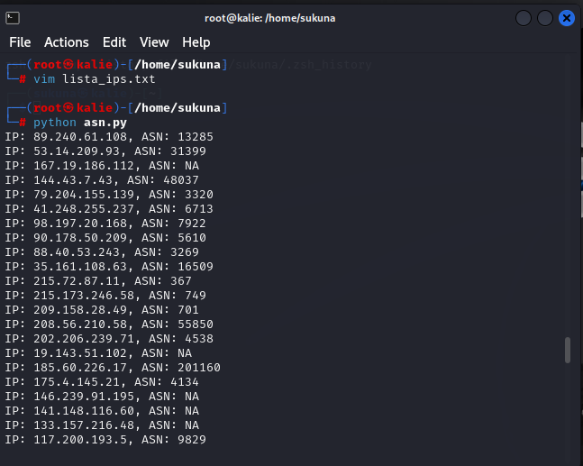

# CloudwwalkTask
# Pré-requisitos

Certifique-se de ter o Python 3.x instalado em seu sistema. Além disso, você precisará das seguintes bibliotecas:
- `pandas`
- `matplotlib`
- `scikit-learn` (para o isolamento de anomalias)
  

Usando as ferramentas acima isolamos as seguintes anomalias:
## - Alto numero de request de um asn
## - Altas requisições de dois países especificos
## - tentativas de injection em vários path's
## - Um host mais vulneravel que outros

Segue anomalias:

# Análise
A Primeira anomalia que notamos é grande numero de requisições vindas ddo mesmo ASN: 396982

 

Filtrando por este ASN temos 10k de linhas de um arquivo com 30k

  
Como podemos ver na imagem abaixo as anomalias estão vindo de dois países US e IN, então fazer um bloqueio geográfico pra um país ou outro pode não ser tão interessante pois varios clients fidedignos podem vir dos mesmos países.

  

Agora nos ip's das requests para os seguintes paths: 

  

vamos validar o que eles tem em comum, se o range e ou o ASN vai nos permitir fazer um bloqueio simples. 

 
Por range ja sabemos que não é o mesmo para todos, para o ASN irei fazer um script rápido para checar todos estes ip's e ter certeza sobre os ASN's: 
 
com o script para checagem de ASN's ele me retornou diferentes tipos de ASN's nas entradas em que o dataset informa 396982 o que pode significar que o os dados foram manipulados. 

# Paths
Os path's mais requisitados mostram em suas URL's tentativas de acesso a areas administrativas e tentativas de injeção de código malicioso

# Solução
Se os ip's em questão avaliados pertencem a um mesmo range e ou ASN como no dataset, podemos combinar a IA isolando anomalias, com regras de firewall e reports diários fazendo com qualquer volume fora do padrão e média dos valores como fora da curva média do nosso dataset gerando uma entrada no iptables por exemplo, usando nosso dataset código de algum faça mais de 5 requests identificadas como injection é bloqueado, caso mais de 5 ips do mesmo range bloqueamos um /24 caso continue um ASN inteiro, em caso extremo.
  
 

